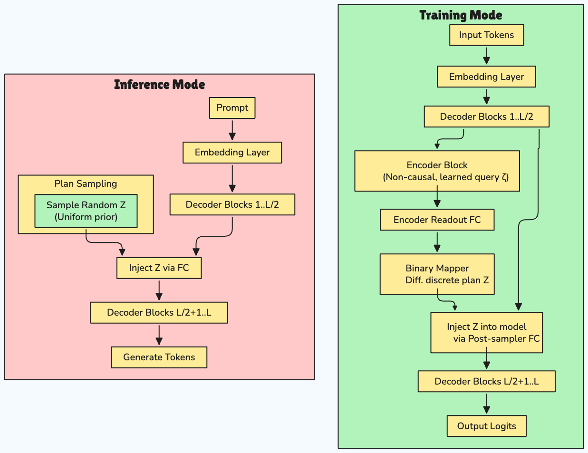

# Free Transformer

[](https://badge.fury.io/py/free-transformer)
[](https://www.python.org/downloads/)
[](https://opensource.org/licenses/MIT)
[](https://udapy.github.io/free-transformer/)
[](https://github.com/udapy/free-transformer/actions)
[](https://github.com/psf/black)

**Free Transformer**: A Llama-style decoder architecture with explicit latent plans, conditional VAE training, and benchmark comparisons against standard Transformers.

Designed for efficient PyTorch training on modern GPUs with full FSDP support and modern optimizations.

> 📖 **[Complete Documentation](https://udapy.github.io/free-transformer/)** | 🚀 **[Quick Start Guide](https://udapy.github.io/free-transformer/getting-started/quick-start/)** | 🏗️ **[Architecture Details](https://udapy.github.io/free-transformer/architecture/overview/)**

---

## What Is the Free Transformer?

Traditional autoregressive Transformers generate each token by conditioning only on the sequence so far ("reactive" behavior).
**Free Transformer** introduces a latent planning mechanism—first choosing a stochastic abstract plan (`Z`), then generating tokens to fit that plan.  
This scalable conditional VAE architecture maintains high-level coherence, improves controllable generation, and enables richer sequence modeling.

### Architecture Overview



---

## Features

### 🏗️ **Architecture**
- **Llama-style backbone**: RMSNorm, SwiGLU, RoPE, Grouped-Query Attention (GQA)
- **Latent Planning**: Explicit plan variable `Z` with differentiable binary coding
- **Conditional VAE**: Reconstruction + KL loss with free bits regularization

### ⚡ **Performance & Scaling**
- **FSDP Support**: Multi-GPU training with PyTorch Fully Sharded Data Parallel
- **Mixed Precision**: Automatic Mixed Precision (AMP) with gradient scaling
- **Memory Efficient**: Gradient checkpointing and optimized attention patterns
- **Modern Optimizations**: bfloat16, efficient parameter sharding

### 🔧 **Development & Training**
- **Flexible Training**: Switchable inference/training flows with mode selection
- **Synthetic + Real Data**: Fast prototyping with built-in synthetic data generation
- **Comprehensive Testing**: Unit/integration tests, benchmark comparisons
- **Quality Assurance**: Type checking, linting, formatting, CI-ready

### 📦 **Usability**
- **Extensible API**: Modular classes, CLI scripts, YAML configuration
- **Docker Support**: Containerized demos and development environment
- **Documentation**: API references, architecture guides, examples

---

## Installation

### From PyPI (Recommended)

```bash
pip install free-transformer
```

### From Source

Using [UV](https://github.com/astral-sh/uv) (recommended):

```bash
# Install UV
curl -LsSf https://astral.sh/uv/install.sh | sh

# Clone and install
git clone https://github.com/udapy/free-transformer.git
cd free-transformer
uv venv --python 3.12
source .venv/bin/activate
uv pip install -e ".[dev]"
```

Using pip:

```bash
git clone https://github.com/udapy/free-transformer.git
cd free-transformer
pip install -e ".[dev]"
```
OR
```bash
uv run pip install free-transformer
```

> 📋 **Detailed installation instructions**: [Installation Guide](https://udapy.github.io/free-transformer/getting-started/installation/)

---

## Quick Start

### 🐳 Docker (Fastest)

The fastest way to try Free Transformer:

```bash
git clone https://github.com/udapy/free-transformer.git
cd free-transformer
docker-compose up free-transformer-demo
```

### 🐍 Python API

```python
from free_transformer import FreeTransformer, ModelConfig

# Create and train a model
config = ModelConfig(vocab_size=1000, hidden_dim=128, num_layers=6, latent_dim=8)
model = FreeTransformer(config)

# Training mode
import torch
tokens = torch.randint(0, 1000, (2, 128))
logits, z_logits = model(tokens, mode='training')

# Generation
generated = model.generate(tokens[:, :10], max_new_tokens=20)
```

### 🚀 Command Line

```bash
# Generate synthetic data and run demo
make demo

# Train models separately
make train-baseline  # Standard Transformer
make train-free      # Free Transformer
make compare         # Compare results
```

> 🎯 **Complete tutorial**: [Quick Start Guide](https://udapy.github.io/free-transformer/getting-started/quick-start/)

---

## Manual Installation & Quick Start Demo

1. **Generate Small Synthetic Data**
   ```bash
   make generate-data-small
   ```

2. **Train Baseline Transformer**
   ```bash
   make train-baseline
   ```

3. **Train Free Transformer**
   ```bash
   make train-free
   ```

4. **Run Model Comparison**
   ```bash
   make compare
   ```

Or run the full pipeline:

```bash
make demo
```

Check results in:
- `checkpoints/baseline/`
- `checkpoints/free/`
- `results/comparison/results.json`

---

## Key Features Comparison

| Feature | Standard Transformer | Free Transformer |
|---------|---------------------|------------------|
| **Generation** | Reactive (token-by-token) | Plan-then-generate |
| **Coherence** | Local | Global + Local |
| **Controllability** | Limited | High (via plan manipulation) |
| **Training** | Cross-entropy loss | Conditional VAE loss |
| **Memory** | Baseline | +10-15% (inference) |
| **Speed** | Baseline | -5-10% (inference) |

> 🔬 **Detailed comparison**: [Architecture Overview](https://udapy.github.io/free-transformer/architecture/overview/)

---

## Repository Structure

```
free-transformer/
├── src/free_transformer/
│   ├── model.py
│   ├── baseline.py
│   ├── encoder.py
│   ├── latent.py
│   ├── injection.py
│   ├── losses.py
│   ├── synthetic_data.py
│   ├── train_utils.py
│   └── config.py
├── examples/
│   ├── train_baseline.py
│   ├── train_free.py
│   ├── eval_compare.py
│   └── generate_data.py
├── configs/
│   ├── baseline.yaml
│   └── free_transformer.yaml
├── docker/
│   ├── demo.sh
│   └── README.md
├── tests/
│   ├── unit/
│   ├── integration/
│   └── test_comparison.py
├── docs/
├── Dockerfile
├── Dockerfile.cpu
├── docker-compose.yml
├── Makefile
├── pyproject.toml
├── .python-version
├── LICENSE
└── README.md
```

---

## Testing & Quality

Run all tests:

```bash
make test
```

Quality checks:

```bash
make quality
```

---

## Advanced Features

### 🚀 **Multi-GPU Training**
```bash
# FSDP training with automatic GPU detection
make train-free-fsdp

# Custom distributed training
torchrun --nproc_per_node=auto examples/train_free.py --use-fsdp
```

### 📊 **Flexible Data**
- HuggingFace datasets integration
- Built-in synthetic data generation
- Custom data loading pipelines

### 🔧 **Extensible Architecture**
- Modular components for easy customization
- Custom loss functions and training schedules
- Plugin system for new features

> 📚 **Learn more**: [Training Guide](https://udapy.github.io/free-transformer/training/guide/) | [Multi-GPU Setup](https://udapy.github.io/free-transformer/training/multi-gpu/)

---

## Documentation

📖 **[Complete Documentation](https://udapy.github.io/free-transformer/)**

### Quick Links
- 🚀 [**Getting Started**](https://udapy.github.io/free-transformer/getting-started/installation/) - Installation and setup
- 🏗️ [**Architecture**](https://udapy.github.io/free-transformer/architecture/overview/) - How Free Transformer works
- 🎯 [**Training Guide**](https://udapy.github.io/free-transformer/training/guide/) - Training best practices
- 📋 [**API Reference**](https://udapy.github.io/free-transformer/api/model/) - Complete API documentation
- 💡 [**Examples**](https://udapy.github.io/free-transformer/examples/basic/) - Code examples and tutorials
- ❓ [**FAQ**](https://udapy.github.io/free-transformer/faq/) - Frequently asked questions

### Local Documentation
```bash
# Serve documentation locally
make docs-serve
# Open http://127.0.0.1:8000
```

---

## License

MIT License — see `LICENSE`

---

## Contributing

We welcome contributions! Please see our [Contributing Guide](https://udapy.github.io/free-transformer/development/contributing/) for details.

### Quick Development Setup
```bash
git clone https://github.com/udapy/free-transformer.git
cd free-transformer
make install-all  # Install with all dependencies
make test         # Run tests
make quality      # Check code quality
```

### Before Submitting
- ✅ Tests pass: `make test`
- ✅ Code quality: `make quality`  
- ✅ Documentation builds: `make docs-build`

> 📋 **Full guidelines**: [Contributing Guide](https://udapy.github.io/free-transformer/development/contributing/)

---

## FAQ

**Can I use this for real-world (non-synthetic) data?**  
Yes! Edit configs and use HuggingFace datasets.

**How do I run distributed training?**  
Use provided CLI flags or edit config. See docs and Makefile.

**How do I change architecture parameters?**  
Edit YAML config files for layer size, latent dim, number of blocks, etc.

**Can I run this without installing dependencies locally?**  
Yes! Use Docker: `docker-compose up free-transformer-demo` for a complete demo.

**What if I don't have a GPU?**  
Use the CPU Docker image: `make docker-build-cpu && make docker-run-cpu`

---

## Citation

If you use Free Transformer in your research, please cite:

```bibtex
@software{free_transformer,
  title={Free Transformer: Explicit Latent Planning for Autoregressive Generation},
  author={Phalak, Uday},
  year={2024},
  url={https://github.com/udapy/free-transformer},
  version={0.1.0}
}
```

## Links

- 📦 [**PyPI Package**](https://pypi.org/project/free-transformer/)
- 📖 [**Documentation**](https://udapy.github.io/free-transformer/)
- 🐛 [**Issues**](https://github.com/udapy/free-transformer/issues)
- 💬 [**Discussions**](https://github.com/udapy/free-transformer/discussions)

---

<div align="center">

**Free Transformer** - Bringing explicit planning to autoregressive generation

[Documentation](https://udapy.github.io/free-transformer/) • [PyPI](https://pypi.org/project/free-transformer/) • [GitHub](https://github.com/udapy/free-transformer)

</div>
