# Free Transformer

**Free Transformer**:
A Llama-style decoder architecture with explicit latent plans, conditional VAE training, and benchmark comparisons against standard Transformers.

Designed for efficient PyTorch training on modern GPUs with full FSDP support and modern optimizations.

---

## What Is the Free Transformer?

Traditional autoregressive Transformers generate each token by conditioning only on the sequence so far ("reactive" behavior).
**Free Transformer** introduces a latent planning mechanism—first choosing a stochastic abstract plan (`Z`), then generating tokens to fit that plan.  
This scalable conditional VAE architecture maintains high-level coherence, improves controllable generation, and enables richer sequence modeling.

### Architecture Overview

```mermaid
flowchart TD
    subgraph "Training Mode"
        A[Input Tokens] --> B[Embedding Layer]
        B --> C["Decoder Blocks 1..L/2"]
        C --> D["Encoder Block
        (Non-causal, learned query ζ)"]
        D --> E[Encoder Readout FC]
        E --> F["Binary Mapper
        Diff. discrete plan Z"]
        F --> G["Inject Z into model
        via Post-sampler FC"]
        C --> G
        G --> H["Decoder Blocks L/2+1..L"]
        H --> I[Output Logits]
    end

    subgraph "Inference Mode"
        AA[Prompt] --> BB[Embedding Layer]
        BB --> CC["Decoder Blocks 1..L/2"]
        subgraph "Plan Sampling"
            DD["Sample Random Z
            (Uniform prior)"]
        end
        DD --> GG[Inject Z via FC]
        CC --> GG
        GG --> HH["Decoder Blocks L/2+1..L"]
        HH --> II[Generate Tokens]
    end
```



---

## Features

### 🏗️ **Architecture**
- **Llama-style backbone**: RMSNorm, SwiGLU, RoPE, Grouped-Query Attention (GQA)
- **Latent Planning**: Explicit plan variable `Z` with differentiable binary coding
- **Conditional VAE**: Reconstruction + KL loss with free bits regularization

### ⚡ **Performance & Scaling**
- **FSDP Support**: Multi-GPU training with PyTorch Fully Sharded Data Parallel
- **Mixed Precision**: Automatic Mixed Precision (AMP) with gradient scaling
- **Memory Efficient**: Gradient checkpointing and optimized attention patterns
- **Modern Optimizations**: bfloat16, efficient parameter sharding

### 🔧 **Development & Training**
- **Flexible Training**: Switchable inference/training flows with mode selection
- **Synthetic + Real Data**: Fast prototyping with built-in synthetic data generation
- **Comprehensive Testing**: Unit/integration tests, benchmark comparisons
- **Quality Assurance**: Type checking, linting, formatting, CI-ready

### 📦 **Usability**
- **Extensible API**: Modular classes, CLI scripts, YAML configuration
- **Docker Support**: Containerized demos and development environment
- **Documentation**: API references, architecture guides, examples

---

## Installation

Using [UV](https://github.com/astral-sh/uv):

```bash
curl -LsSf https://astral.sh/uv/install.sh | sh # Install UV
uv venv --python 3.10
source .venv/bin/activate
uv pip install -e ".[dev]"

# Or after PyPI release
uv pip install free-transformer
```

Standard pip (after PyPI release):

```bash
pip install free-transformer
```

---

## Quick Start with Docker

The fastest way to try the Free Transformer is using Docker:

```bash
# Clone the repository
git clone https://github.com/udapy/free-transformer.git
cd free-transformer

# Run the demo (requires Docker and nvidia-docker for GPU)
docker-compose up free-transformer-demo
```

This will:
1. Generate small synthetic training data
2. Train both baseline and Free Transformer models
3. Compare their performance

For detailed Docker instructions, see [docker/README.md](docker/README.md).

### Docker Options

**GPU Version (Recommended):**
```bash
# Build and run with GPU support
make docker-build
make docker-demo
```

**CPU Version:**
```bash
# Build and run CPU-only version
make docker-build-cpu
make docker-run-cpu
```

**Interactive Development:**
```bash
# Start interactive container for development
make docker-interactive
```

---

## Manual Installation & Quick Start Demo

1. **Generate Small Synthetic Data**
   ```bash
   make generate-data-small
   ```

2. **Train Baseline Transformer**
   ```bash
   make train-baseline
   ```

3. **Train Free Transformer**
   ```bash
   make train-free
   ```

4. **Run Model Comparison**
   ```bash
   make compare
   ```

Or run the full pipeline:

```bash
make demo
```

Check results in:
- `checkpoints/baseline/`
- `checkpoints/free/`
- `results/comparison/results.json`

---

## Python API Example

```python
from free_transformer import FreeTransformer, ModelConfig

config = ModelConfig(
    vocab_size=1000,
    hidden_dim=128,
    num_layers=6,
    num_heads=4,
    latent_dim=8,
)

model = FreeTransformer(config)

# Training mode
tokens = torch.randint(0, 1000, (2, 128))
logits, z_logits = model(tokens, mode='training')

# Inference/generation
generated = model.generate(tokens[:, :10], max_new_tokens=20)
```

---

## Repository Structure

```
free-transformer/
├── src/free_transformer/
│   ├── model.py
│   ├── baseline.py
│   ├── encoder.py
│   ├── latent.py
│   ├── injection.py
│   ├── losses.py
│   ├── synthetic_data.py
│   ├── train_utils.py
│   └── config.py
├── examples/
│   ├── train_baseline.py
│   ├── train_free.py
│   ├── eval_compare.py
│   └── generate_data.py
├── configs/
│   ├── baseline.yaml
│   └── free_transformer.yaml
├── docker/
│   ├── demo.sh
│   └── README.md
├── tests/
│   ├── unit/
│   ├── integration/
│   └── test_comparison.py
├── docs/
├── Dockerfile
├── Dockerfile.cpu
├── docker-compose.yml
├── Makefile
├── pyproject.toml
├── .python-version
├── LICENSE
└── README.md
```

---

## Testing & Quality

Run all tests:

```bash
make test
```

Quality checks:

```bash
make quality
```

---

## Advanced Features

### 🚀 **Multi-GPU Training**
```bash
# FSDP training with automatic GPU detection
make train-baseline-fsdp
make train-free-fsdp

# Or use torchrun directly
torchrun --nproc_per_node=auto examples/train_free.py --config configs/free_transformer.yaml --use-fsdp
```

### 📊 **Custom Datasets**
- Plug in HuggingFace datasets via config files
- Built-in synthetic data generation for quick prototyping
- Extensible data loading pipeline

### 🔧 **Extensibility**
- Modular architecture for easy customization
- Add custom loss objectives, attention mechanisms, or model components
- Hook system for training callbacks and monitoring

### ⚠️ **Current Limitations**
- **DeepSpeed**: Not yet implemented (FSDP is the current distributed training solution)
- **Flash Attention**: Uses standard PyTorch attention (Flash Attention integration planned)
- **Inference Optimizations**: No quantization or specialized inference backends yet

---

## Documentation

- Architecture: `docs/architecture.md`
- API: auto-generated documentation (see `docs/`)
- Example configs and usage tips included.

---

## License

MIT License — see `LICENSE`

---

## Contributing

PRs and issues welcome — see `CONTRIBUTING.md`

Before submitting code, run:

```bash
make test
make quality
```

---

## FAQ

**Can I use this for real-world (non-synthetic) data?**  
Yes! Edit configs and use HuggingFace datasets.

**How do I run distributed training?**  
Use provided CLI flags or edit config. See docs and Makefile.

**How do I change architecture parameters?**  
Edit YAML config files for layer size, latent dim, number of blocks, etc.

**Can I run this without installing dependencies locally?**  
Yes! Use Docker: `docker-compose up free-transformer-demo` for a complete demo.

**What if I don't have a GPU?**  
Use the CPU Docker image: `make docker-build-cpu && make docker-run-cpu`

---

## Links

- [ArXiv: Free Transformer Paper](https://arxiv.org/abs/XXXX.XXXXX)
- [PyPI (after release)](https://pypi.org/project/free-transformer/)
- [GitHub Issues](https://github.com/yourusername/free-transformer/issues)