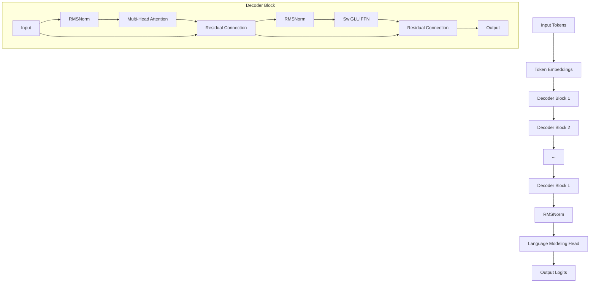

# Baseline Transformer Architecture

This page describes the baseline Transformer model used for comparison with the Free Transformer.

## Overview

The baseline model is a standard decoder-only Transformer architecture based on the Llama design. It serves as a control to evaluate the benefits of the Free Transformer's latent planning mechanism.

## Architecture Components

### 1. Decoder-Only Design

The baseline follows the GPT/Llama paradigm:
- **Autoregressive generation**: Predicts next token based on previous tokens
- **Causal attention**: Each position can only attend to previous positions
- **Standard training**: Cross-entropy loss on next-token prediction

### 2. Modern Optimizations

#### RMSNorm
Instead of LayerNorm, uses Root Mean Square Layer Normalization:
```python
def rms_norm(x, weight, eps=1e-6):
    variance = x.pow(2).mean(-1, keepdim=True)
    x = x * torch.rsqrt(variance + eps)
    return weight * x
```

Benefits:
- More stable training
- Better performance on large models
- Simpler computation

#### SwiGLU Activation
Uses SwiGLU instead of standard ReLU/GELU:
```python
def swiglu(x):
    x, gate = x.chunk(2, dim=-1)
    return F.silu(gate) * x
```

Benefits:
- Better performance than ReLU/GELU
- Gating mechanism improves expressivity
- Used in modern large language models

#### Rotary Position Embedding (RoPE)
Encodes position information through rotation:
```python
def apply_rope(q, k, cos, sin):
    q_rot = (q * cos) + (rotate_half(q) * sin)
    k_rot = (k * cos) + (rotate_half(k) * sin)
    return q_rot, k_rot
```

Benefits:
- Better length extrapolation
- Relative position encoding
- No learned position embeddings needed

#### Grouped-Query Attention (GQA)
Reduces memory usage while maintaining performance:
```python
# Standard: num_heads key-value heads
# GQA: num_key_value_heads < num_heads
# Queries are grouped to share key-value pairs
```

Benefits:
- Reduced memory usage
- Faster inference
- Minimal performance loss

## Model Architecture



## Implementation Details

### Attention Mechanism

```python
class GroupedQueryAttention(nn.Module):
    def __init__(self, config):
        self.num_heads = config.num_heads
        self.num_key_value_heads = config.num_key_value_heads
        self.head_dim = config.hidden_dim // config.num_heads
        
        self.q_proj = nn.Linear(config.hidden_dim, config.num_heads * self.head_dim)
        self.k_proj = nn.Linear(config.hidden_dim, config.num_key_value_heads * self.head_dim)
        self.v_proj = nn.Linear(config.hidden_dim, config.num_key_value_heads * self.head_dim)
        self.o_proj = nn.Linear(config.num_heads * self.head_dim, config.hidden_dim)
        
    def forward(self, hidden_states, attention_mask=None):
        # Compute queries, keys, values
        queries = self.q_proj(hidden_states)
        keys = self.k_proj(hidden_states)
        values = self.v_proj(hidden_states)
        
        # Reshape and apply attention
        # ... (standard attention computation)
        
        return output
```

### Feed-Forward Network

```python
class SwiGLU(nn.Module):
    def __init__(self, config):
        self.gate_proj = nn.Linear(config.hidden_dim, config.intermediate_size)
        self.up_proj = nn.Linear(config.hidden_dim, config.intermediate_size)
        self.down_proj = nn.Linear(config.intermediate_size, config.hidden_dim)
        
    def forward(self, x):
        gate = self.gate_proj(x)
        up = self.up_proj(x)
        return self.down_proj(F.silu(gate) * up)
```

## Training Characteristics

### Loss Function
Standard cross-entropy loss for next-token prediction:
```python
def compute_loss(logits, targets):
    shift_logits = logits[..., :-1, :].contiguous()
    shift_labels = targets[..., 1:].contiguous()
    
    loss = F.cross_entropy(
        shift_logits.view(-1, shift_logits.size(-1)),
        shift_labels.view(-1),
        ignore_index=-100
    )
    return loss
```

### Training Dynamics
- **Stable training**: Modern components provide stable gradients
- **Efficient scaling**: Works well with large models and datasets
- **Fast convergence**: Good optimization properties

## Performance Characteristics

### Memory Usage
- **Parameters**: ~7N parameters for hidden dimension N
- **Activation memory**: O(batch_size × seq_len × hidden_dim)
- **Attention memory**: O(batch_size × num_heads × seq_len²)

### Computational Complexity
- **Forward pass**: O(seq_len × hidden_dim²) per layer
- **Attention**: O(seq_len² × hidden_dim) per layer
- **Total**: O(num_layers × seq_len × hidden_dim²)

## Comparison with Free Transformer

| Aspect | Baseline Transformer | Free Transformer |
|--------|---------------------|------------------|
| **Architecture** | Decoder-only | Decoder + Encoder |
| **Parameters** | ~7N (for hidden_dim N) | ~7N + encoder params |
| **Training Loss** | Cross-entropy | Cross-entropy + KL |
| **Generation** | Autoregressive | Plan-conditioned |
| **Memory (Training)** | Baseline | +30-40% |
| **Memory (Inference)** | Baseline | +10-15% |
| **Speed (Training)** | Baseline | -20-30% |
| **Speed (Inference)** | Baseline | -5-10% |

## Use Cases

### When to Use Baseline
- **Maximum efficiency**: When computational resources are limited
- **Simple tasks**: Short sequences, simple patterns
- **Established workflows**: When using existing training pipelines
- **Benchmarking**: As a control for evaluating improvements

### Limitations
- **Local coherence**: Struggles with long-range dependencies
- **Limited controllability**: Hard to guide generation
- **Reactive generation**: No explicit planning mechanism

## Configuration

### Model Configuration
```yaml
model:
  vocab_size: 50000
  hidden_dim: 512
  num_layers: 12
  num_heads: 8
  num_key_value_heads: 2
  intermediate_size: 2048
  max_seq_len: 1024
  dropout: 0.1
  rms_norm_eps: 1e-6
  rope_theta: 10000.0
```

### Training Configuration
```yaml
training:
  batch_size: 32
  learning_rate: 1e-4
  num_epochs: 10
  weight_decay: 0.01
  warmup_steps: 1000
  gradient_clip_norm: 1.0
```

## Implementation Example

```python
from free_transformer import BaselineTransformer, ModelConfig

# Create configuration
config = ModelConfig(
    vocab_size=50000,
    hidden_dim=512,
    num_layers=12,
    num_heads=8,
    max_seq_len=1024
)

# Initialize model
model = BaselineTransformer(config)

# Training
model.train()
logits = model(input_ids)
loss = F.cross_entropy(logits.view(-1, config.vocab_size), targets.view(-1))

# Generation
model.eval()
generated = model.generate(prompt, max_new_tokens=100)
```

## Next Steps

- **[Free Transformer](free-transformer.md)**: Compare with the enhanced architecture
- **[Training Guide](../training/guide.md)**: Learn how to train both models
- **[Examples](../examples/basic.md)**: See practical usage examp