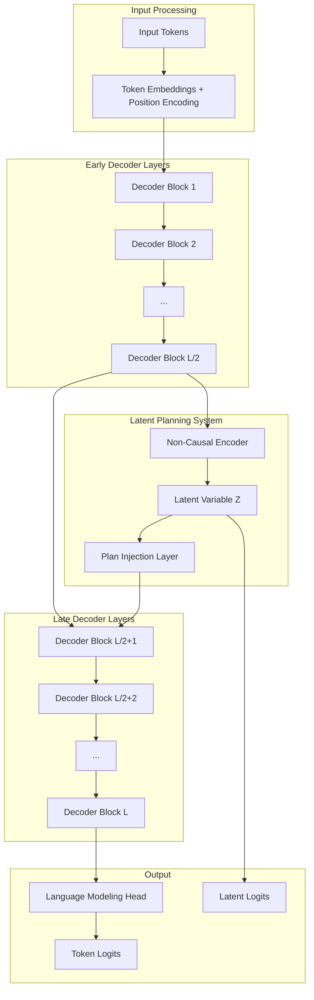

# Free Transformer Architecture

This page provides a detailed technical explanation of the Free Transformer architecture and its components.

## Core Architecture

The Free Transformer extends the standard decoder-only Transformer with a latent planning mechanism. The key innovation is the introduction of an explicit latent variable `Z` that represents an abstract "plan" for the entire sequence.



## Detailed Components

### 1. Decoder Backbone

The Free Transformer uses a Llama-style decoder architecture with modern optimizations:

#### Layer Structure
```python
class DecoderBlock(nn.Module):
    def __init__(self, config):
        self.attention = GroupedQueryAttention(config)
        self.feed_forward = SwiGLU(config)
        self.attention_norm = RMSNorm(config.hidden_dim)
        self.ffn_norm = RMSNorm(config.hidden_dim)
    
    def forward(self, x, attention_mask=None):
        # Pre-norm attention
        normed_x = self.attention_norm(x)
        attn_out = self.attention(normed_x, attention_mask)
        x = x + attn_out
        
        # Pre-norm feed-forward
        normed_x = self.ffn_norm(x)
        ffn_out = self.feed_forward(normed_x)
        x = x + ffn_out
        
        return x
```

#### Key Features
- **RMSNorm**: More stable than LayerNorm, especially for large models
- **SwiGLU**: Gated linear unit activation that outperforms ReLU/GELU
- **Grouped-Query Attention**: Reduces memory usage while maintaining performance
- **RoPE**: Rotary Position Embedding for better length extrapolation

### 2. Non-Causal Encoder

The encoder is the key component that enables latent planning:

```python
class NonCausalEncoder(nn.Module):
    def __init__(self, config):
        self.layers = nn.ModuleList([
            EncoderBlock(config) for _ in range(config.encoder_layers)
        ])
        self.learned_query = nn.Parameter(torch.randn(config.hidden_dim))
        self.readout = nn.Linear(config.hidden_dim, config.hidden_dim)
    
    def forward(self, hidden_states):
        # Use learned query to aggregate information
        query = self.learned_query.unsqueeze(0).expand(
            hidden_states.size(0), 1, -1
        )
        
        # Non-causal attention over entire sequence
        for layer in self.layers:
            query = layer(query, hidden_states)
        
        # Readout to latent space
        latent_repr = self.readout(query.squeeze(1))
        return latent_repr
```

#### Design Principles
- **Non-causal**: Can attend to the entire sequence, not just previous tokens
- **Learned query**: Single learnable vector that aggregates sequence information
- **Separate parameters**: Independent from decoder to avoid interference

### 3. Binary Latent Mapping

The continuous encoder output is mapped to a discrete binary plan:

```python
class BinaryMapper(nn.Module):
    def __init__(self, config):
        self.projection = nn.Linear(config.hidden_dim, config.latent_dim)
        self.temperature = config.gumbel_temperature
    
    def forward(self, encoder_output, training=True):
        # Project to latent dimension
        logits = self.projection(encoder_output)
        
        if training:
            # Gumbel-Softmax for differentiable sampling
            binary_soft = F.gumbel_softmax(
                torch.stack([logits, -logits], dim=-1),
                tau=self.temperature,
                hard=True
            )
            return binary_soft[..., 0], logits
        else:
            # Hard sampling for inference
            binary_hard = (logits > 0).float()
            return binary_hard, logits
```

#### Key Features
- **Gumbel-Softmax**: Enables gradient flow through discrete sampling
- **Hard sampling**: Uses actual binary values during inference
- **Temperature control**: Balances between discrete and continuous

### 4. Plan Injection Mechanism

The binary plan is injected into the decoder representations:

```python
class PlanInjection(nn.Module):
    def __init__(self, config):
        self.plan_projection = nn.Linear(
            config.latent_dim, 
            config.hidden_dim
        )
        self.gate = nn.Linear(config.hidden_dim, config.hidden_dim)
        
    def forward(self, decoder_hidden, binary_plan):
        # Project plan to hidden dimension
        plan_repr = self.plan_projection(binary_plan)
        
        # Expand to sequence length
        seq_len = decoder_hidden.size(1)
        plan_repr = plan_repr.unsqueeze(1).expand(-1, seq_len, -1)
        
        # Gated injection
        gate_values = torch.sigmoid(self.gate(decoder_hidden))
        injected = decoder_hidden + gate_values * plan_repr
        
        return injected
```

#### Injection Strategies
1. **Additive**: `hidden + plan_projection(z)`
2. **Gated**: `hidden + gate * plan_projection(z)`
3. **Concatenation**: `concat(hidden, plan_projection(z))`
4. **Cross-attention**: Plan as keys/values in attention

## Training Dynamics

### Forward Pass Flow

1. **Input Processing**: Tokenize and embed input sequence
2. **Early Decoding**: Process through first L/2 decoder layers
3. **Encoding**: Non-causal encoder creates sequence representation
4. **Latent Mapping**: Map to binary plan Z
5. **Plan Injection**: Inject plan into decoder hidden states
6. **Late Decoding**: Process through remaining L/2 decoder layers
7. **Output**: Generate token logits and latent logits

### Loss Computation

The model is trained with a composite VAE loss:

```python
def compute_loss(logits, z_logits, targets, config):
    # Reconstruction loss (standard language modeling)
    recon_loss = F.cross_entropy(
        logits.view(-1, config.vocab_size),
        targets.view(-1),
        ignore_index=-100
    )
    
    # KL divergence loss (regularization)
    # Assuming uniform prior p(z) = 0.5 for each bit
    posterior = torch.sigmoid(z_logits)
    prior = torch.full_like(posterior, 0.5)
    
    kl_loss = F.kl_div(
        torch.log(posterior + 1e-8),
        prior,
        reduction='batchmean'
    )
    
    # Free bits regularization
    kl_loss = torch.clamp(kl_loss, min=config.free_bits)
    
    # Total loss
    total_loss = recon_loss + config.kl_weight * kl_loss
    
    return {
        'total_loss': total_loss,
        'recon_loss': recon_loss,
        'kl_loss': kl_loss
    }
```

## Inference Mode

During inference, the model operates differently:

1. **No Encoder**: The encoder is not used during generation
2. **Prior Sampling**: Sample Z from uniform prior distribution
3. **Plan Injection**: Inject sampled plan into decoder
4. **Generation**: Standard autoregressive generation

```python
def inference_forward(self, input_ids, max_new_tokens=100):
    batch_size = input_ids.size(0)
    
    # Sample latent plan from prior
    z_sample = torch.bernoulli(
        torch.full((batch_size, self.config.latent_dim), 0.5)
    ).to(input_ids.device)
    
    # Process through early layers
    hidden = self.embed_tokens(input_ids)
    for layer in self.early_layers:
        hidden = layer(hidden)
    
    # Inject plan
    hidden = self.plan_injection(hidden, z_sample)
    
    # Process through late layers
    for layer in self.late_layers:
        hidden = layer(hidden)
    
    # Generate tokens autoregressively
    return self.generate_tokens(hidden, max_new_tokens)
```

## Architectural Variants

### 1. Multi-Layer Injection

Instead of single injection point, inject at multiple layers:

```python
class MultiLayerInjection(nn.Module):
    def __init__(self, config):
        self.injection_layers = nn.ModuleList([
            PlanInjection(config) 
            for _ in range(config.num_injection_layers)
        ])
    
    def forward(self, hidden_states_list, binary_plan):
        injected_states = []
        for hidden, injection in zip(hidden_states_list, self.injection_layers):
            injected = injection(hidden, binary_plan)
            injected_states.append(injected)
        return injected_states
```

### 2. Hierarchical Plans

Use multiple latent variables at different levels:

```python
class HierarchicalPlanner(nn.Module):
    def __init__(self, config):
        self.global_encoder = NonCausalEncoder(config)
        self.local_encoders = nn.ModuleList([
            NonCausalEncoder(config) 
            for _ in range(config.num_local_plans)
        ])
    
    def forward(self, hidden_states):
        # Global plan for entire sequence
        global_plan = self.global_encoder(hidden_states)
        
        # Local plans for subsequences
        local_plans = []
        seq_len = hidden_states.size(1)
        chunk_size = seq_len // len(self.local_encoders)
        
        for i, encoder in enumerate(self.local_encoders):
            start_idx = i * chunk_size
            end_idx = (i + 1) * chunk_size
            chunk = hidden_states[:, start_idx:end_idx]
            local_plan = encoder(chunk)
            local_plans.append(local_plan)
        
        return global_plan, local_plans
```

### 3. Continuous Latents

Alternative to binary plans using continuous latent variables:

```python
class ContinuousMapper(nn.Module):
    def __init__(self, config):
        self.mean_projection = nn.Linear(config.hidden_dim, config.latent_dim)
        self.logvar_projection = nn.Linear(config.hidden_dim, config.latent_dim)
    
    def forward(self, encoder_output, training=True):
        mean = self.mean_projection(encoder_output)
        logvar = self.logvar_projection(encoder_output)
        
        if training:
            # Reparameterization trick
            std = torch.exp(0.5 * logvar)
            eps = torch.randn_like(std)
            z = mean + eps * std
            return z, mean, logvar
        else:
            # Use mean during inference
            return mean, mean, logvar
```

## Performance Considerations

### Memory Usage
- **Training**: ~30-40% more memory than baseline due to encoder
- **Inference**: ~10-15% more memory due to latent computations

### Computational Overhead
- **Training**: ~20-30% slower due to encoder and VAE loss
- **Inference**: ~5-10% slower due to plan injection

### Optimization Strategies
1. **Gradient Checkpointing**: Reduce memory at cost of computation
2. **Mixed Precision**: Use bfloat16 for faster training
3. **Efficient Attention**: Flash Attention integration (planned)
4. **Model Parallelism**: FSDP for large models

## Next Steps

- **[Latent Planning](latent-planning.md)**: Deep dive into the planning mechanism
- **[Baseline Comparison](baseline.md)**: Compare with standard Transformers
- **[Training Guide](../training/guide.md)**: How to train effectively