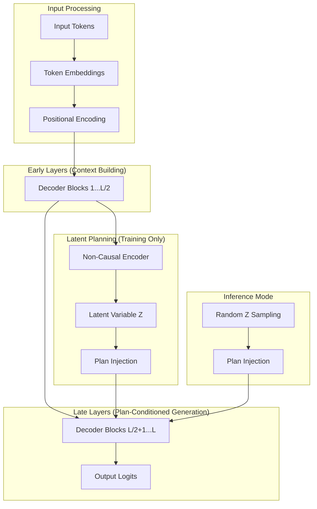

# Architecture Overview

The Free Transformer introduces a novel approach to sequence modeling by incorporating explicit latent planning into the traditional autoregressive generation process.

## Core Concept

Traditional autoregressive Transformers generate tokens sequentially, conditioning only on previously generated tokens. This "reactive" approach can lead to:

- **Local coherence** but **global inconsistency**
- **Difficulty with long-range planning**
- **Limited controllability** in generation

The Free Transformer addresses these limitations by introducing a **latent planning mechanism** that:

1. **First** creates an abstract plan `Z` for the entire sequence
2. **Then** generates tokens conditioned on both the history and the plan

## High-Level Architecture



## Key Components

### 1. Decoder Backbone

Based on the Llama architecture with modern optimizations:

- **RMSNorm**: More stable than LayerNorm
- **SwiGLU Activation**: Better than ReLU/GELU
- **RoPE**: Rotary Position Embedding for better length generalization
- **Grouped-Query Attention (GQA)**: Efficient multi-head attention

### 2. Latent Planning System

The core innovation consists of three components:

#### Encoder Block
- **Non-causal attention**: Can attend to the entire sequence
- **Learned query vector ζ**: Aggregates sequence information
- **Separate from decoder**: Doesn't interfere with autoregressive flow

#### Binary Mapper
- **Differentiable discretization**: Converts continuous representations to binary plans
- **Gumbel-Softmax**: Enables gradient flow through discrete sampling
- **Configurable dimensionality**: Latent plan size `Z ∈ {0,1}^d`

#### Plan Injection
- **Post-sampler FC layer**: Integrates plan into decoder representations
- **Residual connections**: Preserves original information flow
- **Layer-wise injection**: Plan influences multiple decoder layers

### 3. Conditional VAE Framework

The model is trained as a conditional Variational Autoencoder:

#### Training Mode
```
p(x|z) * p(z|x) = Reconstruction * Posterior
```

- **Reconstruction Loss**: Standard language modeling loss
- **KL Divergence**: Regularizes latent space toward uniform prior
- **Free Bits**: Prevents posterior collapse

#### Inference Mode
```
p(x|z) * p(z) = Generation * Prior
```

- **Prior Sampling**: Sample `z` from uniform distribution
- **Conditional Generation**: Generate tokens given the sampled plan

## Training vs Inference Modes

### Training Mode Flow

1. **Forward Pass**: Input → Early Layers → Encoder → Latent Z
2. **Plan Injection**: Z → Late Layers → Output Logits
3. **Loss Computation**: Reconstruction + KL Divergence
4. **Backward Pass**: Gradients flow through differentiable components

### Inference Mode Flow

1. **Context Processing**: Prompt → Early Layers
2. **Plan Sampling**: Sample Z from uniform prior
3. **Plan Injection**: Z → Late Layers
4. **Generation**: Autoregressive token generation

## Mathematical Formulation

### Encoder
The encoder produces a latent representation from the full sequence:

$$h_{enc} = \text{Encoder}(X, \zeta)$$

where $\zeta$ is a learned query vector and $X$ is the input sequence.

### Binary Mapping
The continuous representation is mapped to a binary plan:

$$Z = \text{BinaryMapper}(h_{enc})$$

using differentiable binary encoding (e.g., Gumbel-Softmax).

### Plan Injection
The binary plan is injected into the decoder:

$$h_{inj} = h_{dec} + \text{FC}(Z)$$

where $h_{dec}$ comes from the early decoder layers.

### Loss Function
The total loss combines reconstruction and regularization:

$$\mathcal{L} = \mathcal{L}_{recon} + \beta \cdot \text{KL}(q(Z|X) || p(Z))$$

with free bits regularization to prevent collapse.

## Design Principles

### 1. Modularity
- **Separate components**: Encoder, decoder, and injection are independent
- **Configurable**: Easy to modify latent dimensions, injection points
- **Extensible**: Can add new components without major changes

### 2. Efficiency
- **Shared backbone**: Reuses decoder architecture
- **Minimal overhead**: Encoder only active during training
- **Memory efficient**: Gradient checkpointing and optimized attention

### 3. Compatibility
- **Standard interfaces**: Compatible with HuggingFace ecosystem
- **Flexible training**: Works with existing training pipelines
- **Easy deployment**: Standard PyTorch model for inference

## Comparison with Baselines

| Aspect | Standard Transformer | Free Transformer |
|--------|---------------------|------------------|
| **Planning** | Implicit, reactive | Explicit, proactive |
| **Coherence** | Local | Global + Local |
| **Controllability** | Limited | High (via plan manipulation) |
| **Training** | Language modeling | Conditional VAE |
| **Inference** | Autoregressive | Plan-conditioned autoregressive |
| **Complexity** | O(n²) attention | O(n²) + O(d) latent |

## Next Steps

- **[Free Transformer Details](free-transformer.md)**: Deep dive into the model
- **[Latent Planning](latent-planning.md)**: Understanding the planning mechanism
- **[Training Guide](../training/guide.md)**: How to train the model effectively