# Free Transformer

**Free Transformer**: A Llama-style decoder architecture with explicit latent plans, conditional VAE training, and benchmark comparisons against standard Transformers.

Designed for efficient PyTorch training on modern GPUs with full FSDP support and modern optimizations.

## What Is the Free Transformer?

Traditional autoregressive Transformers generate each token by conditioning only on the sequence so far ("reactive" behavior). **Free Transformer** introduces a latent planning mechanism—first choosing a stochastic abstract plan (`Z`), then generating tokens to fit that plan. This scalable conditional VAE architecture maintains high-level coherence, improves controllable generation, and enables richer sequence modeling.

## Key Features

### 🏗️ **Architecture**
- **Llama-style backbone**: RMSNorm, SwiGLU, RoPE, Grouped-Query Attention (GQA)
- **Latent Planning**: Explicit plan variable `Z` with differentiable binary coding
- **Conditional VAE**: Reconstruction + KL loss with free bits regularization

### ⚡ **Performance & Scaling**
- **FSDP Support**: Multi-GPU training with PyTorch Fully Sharded Data Parallel
- **Mixed Precision**: Automatic Mixed Precision (AMP) with gradient scaling
- **Memory Efficient**: Gradient checkpointing and optimized attention patterns
- **Modern Optimizations**: bfloat16, efficient parameter sharding

### 🔧 **Development & Training**
- **Flexible Training**: Switchable inference/training flows with mode selection
- **Synthetic + Real Data**: Fast prototyping with built-in synthetic data generation
- **Comprehensive Testing**: Unit/integration tests, benchmark comparisons
- **Quality Assurance**: Type checking, linting, formatting, CI-ready

## Quick Start

The fastest way to get started is with Docker:

```bash
git clone https://github.com/udapy/free-transformer.git
cd free-transformer
docker-compose up free-transformer-demo
```

Or install locally:

```bash
uv pip install -e ".[dev]"
make demo
```

## Architecture Overview

```mermaid
flowchart TD
    subgraph "Training Mode"
        A[Input Tokens] --> B[Embedding Layer]
        B --> C["Decoder Blocks 1..L/2"]
        C --> D["Encoder Block<br/>(Non-causal, learned query ζ)"]
        D --> E[Encoder Readout FC]
        E --> F["Binary Mapper<br/>Diff. discrete plan Z"]
        F --> G["Inject Z into model<br/>via Post-sampler FC"]
        C --> G
        G --> H["Decoder Blocks L/2+1..L"]
        H --> I[Output Logits]
    end

    subgraph "Inference Mode"
        AA[Prompt] --> BB[Embedding Layer]
        BB --> CC["Decoder Blocks 1..L/2"]
        subgraph "Plan Sampling"
            DD["Sample Random Z<br/>(Uniform prior)"]
        end
        DD --> GG[Inject Z via FC]
        CC --> GG
        GG --> HH["Decoder Blocks L/2+1..L"]
        HH --> II[Generate Tokens]
    end
```



## Navigation

- **[Getting Started](getting-started/installation.md)**: Installation and setup
- **[Architecture](architecture/overview.md)**: Deep dive into the model design
- **[Training](training/guide.md)**: Training guides and best practices
- **[API Reference](api/model.md)**: Complete API documentation
- **[Examples](examples/basic.md)**: Code examples and tutorials

## License

MIT License — see [LICENSE](https://github.com/udapy/free-transformer/blob/main/LICENSE)